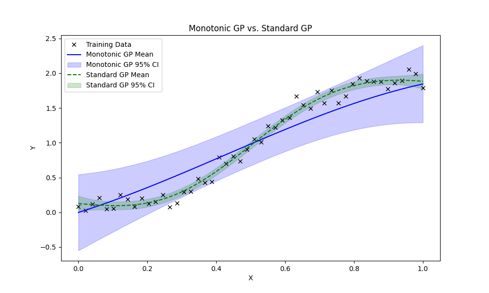

# Monotonization of Gaussian Processes

This repository implements a monotonic Gaussian Process (GP) regression model using the `GPy` library. The code enforces monotonicity in GP models by adding virtual observations and compares the performance of monotonic GP with a standard GP on a step function dataset. The idea was taken on from Rihimäki and Vehtari(2010).

## Features

- **Custom Likelihoods**: Implements `ProbitLikelihood` and `CompositeLikelihood` for handling monotonicity constraints.
- **Monotonic GP Enforcement**: Adds virtual observations to ensure monotonicity in the GP model.
- **Visualization**: Compares the monotonic GP and standard GP with confidence intervals on a step function dataset.

## Report

- This file includes the theory,examples and their inference required to understand this project.
- It was orignally written as a graded assignment for my semester project
- It has a whole section on Gaussian processes and Expectation propogation(see Theoretical background) which introduces the concepts from the bare bones.
- The whole file may not be visible at once, please download it to see all its contents.

## Dependencies

- numpy (1.26.4)
- Gpy (1.13.2)
- scipy (1.12.0)
- matplotlib (1.17.0)
- scikit-learn (3.6.0)

## Results

Here are some outputs of the model:

![Y = sin(X) ; X ∈ [0, π/2]](Sample_Outputs/output2.png)
*Figure 1: Monotonic GP Fit Result for Y = 2x.*

*Figure 2: Monotonic GP Fit Result for Y = 2/1+e(−8X+4).*

To know more about the implementation and analysis, [click here to view the Jupyter Notebook](notebook/monotonic_gp_og.ipynb).

## Contributing

Contributions are welcome! If you find a bug or have a feature request, please open an issue. Feel free to submit pull requests to improve the code or add new features.

## License

This project is licensed under the MIT License. See the [LICENSE](LICENSE) file for details.

## References

- **Rihimäki, J., & Vehtari, A. (2010)**:  
  *Gaussian processes with monotonicity information.*

For questions or feedback, feel free to reach out at [kartik.khurana@students.iiserpune.ac.in] or open an issue on Github

